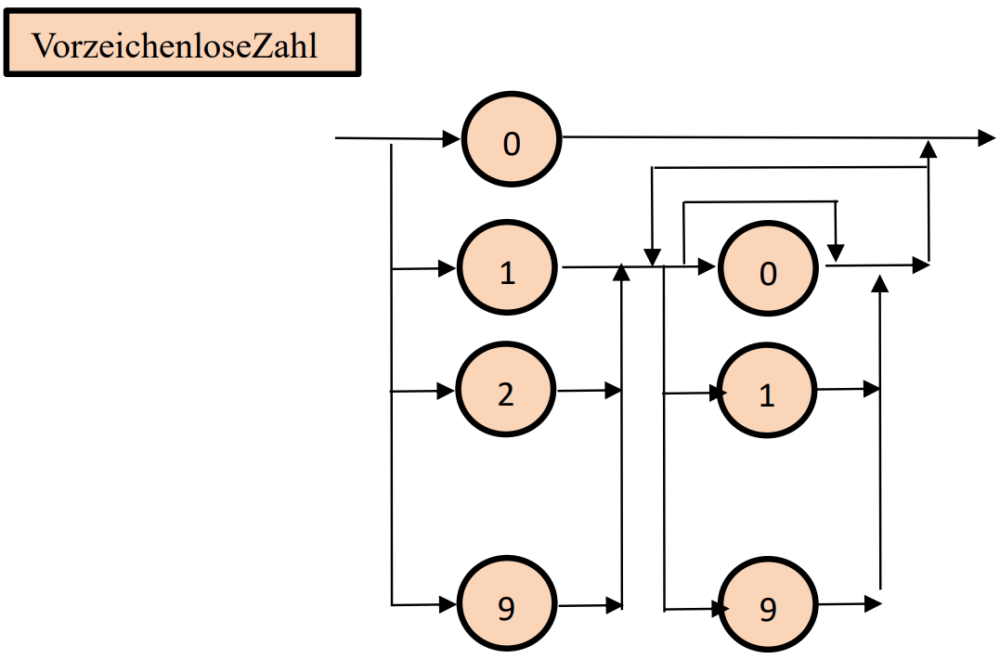
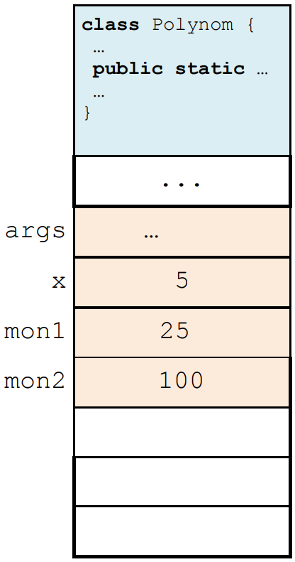
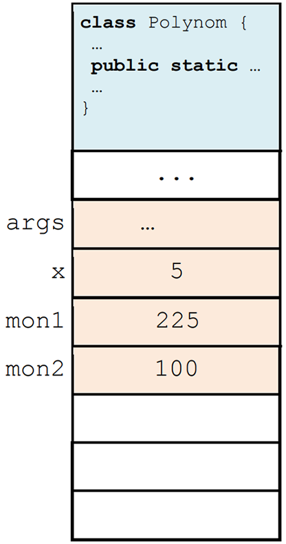

# Erste Schritte in Java

## Aufgabe 1

### ErläuternSie den Unterschiedzwischen Syntax und Semantik

Syntax beschreibt x

Semantik ist y

### Was versteht man unter einem Literal?

Ein Literal ist...

### Benennen Sie die Unterschiede und Gemeinsamkeiten von Variablen und Konstanten

### Was versteht man unter dem Kontrollfluss?

## Aufgabe 2

Das folgende Syntaxdiagramm sei gegeben:


### Welche der folgenden Worte sind FastIntegerZahlen?

- 0173272
- 1132
- 113201

> 2 ist eine FastIntegerZahl

### Ändern Sie obiges Syntaxdiagramm so ab, dass es allen vorzeichenlosen ganzen Zahlen ohne führende Nullen entspricht



## Aufgabe 3

### Skizzieren Sie jeweils den Speicherinhalt nach Ausführung der Zeilen 5 und 6des folgenden Programms

```java
public class Polynom {
    public static void main(String[]args) {
        final intx = 5;
        int mon1 = 5 *x;
        int mon2 = mon1 + 3 * x * x;
        mon1 = mon2 + x * x * x;
        System.out.println(mon1);
    }
}
```

<center>Nach Zeile 5 | Nach Zeile 6

 </center>

Ausgabe:

> 225
